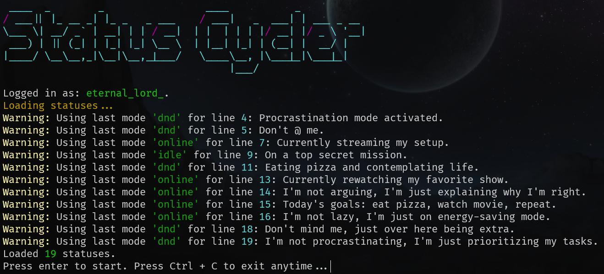
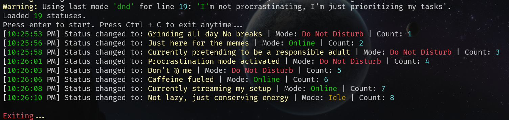

# Discord Status Cycler

This Python script automatically updates your Discord status message and mode (Online, Do Not Disturb, Idle, Invisible) on a scheduled delay. The script reads statuses from a text file, logs changes in the console, and handles errors smoothly, making it easy to keep your profile dynamic and engaging.

## Features

- **Custom Status and Mode:** Configure each status message with a specific mode (Online, Do Not Disturb, Idle, Invisible).
- **Automatic Rotation:** Cycles through statuses based on a configurable time interval.
- **Rich Console Output:** Utilizes the `rich` library for colorful and formatted console messages.
- **Error Handling:** Handles invalid modes, missing files, and connection issues with helpful messages.
- **Optional Logging and Terminal Clearing:** Option to log each status change and periodically clear the console for a clean interface.

## Requirements

- Python 3.6+
- Required packages listed in `requirements.txt`

### Install Dependencies

To install the required packages, run:

```bash
pip install -r requirements.txt
```

## Setup

1. **Get Your Discord Token:**  
   You need your Discord API token to authenticate the script. To get this token:

   - Open Discord on a web browser.
   - Open Developer Tools (usually F12 or right-click > Inspect).
   - Go to the **Network** tab, refresh Discord, and search for "applications" or "users/@me". Copy the token from the request header.

2. **Insert Your Token:**  
   Open the script file and replace `TOKEN = "PASTE YOUR TOKEN HERE"` with your actual Discord token.

3. **Create a `statuses.txt` File:**  
   This file will store the list of statuses and their modes. Each line should follow this format:

   ```
   STATUS_MESSAGE ;; MODE
   ```

   - `STATUS_MESSAGE` is your custom message.
   - `MODE` is the Discord status mode: `online`, `dnd`, `idle`, or `invisible`.
   - `;;` can be replaced with any separator you prefer. But make sure to change it in the script as well.

   **Example `statuses.txt`:**

   ```
   Feeling productive ;; online
   Taking a break ;; idle
   Do not disturb, coding! ;; dnd
   Working in stealth mode ;; invisible
   ```

   > **Note:** If the mode is missing or incorrect, the script will log a warning and default to the last valid mode.

## Configuration

In the script, you can adjust these constants:

- `DELAY`: Time (in seconds) to wait before switching to the next status.
- `LOG_CHANGE`: Set to `True` to log each status change to the console.
- `CLEAR_TERMINAL`: Set to `True` to clear the terminal periodically.
- `CLEAR_INTERVAL`: Defines how many status changes occur before clearing the terminal.
- `FILENAME`: The name of the text file to read statuses from.
- `MODE_SEPARATOR`: The separator between status and mode in the text file.

## Usage

1. **Run the Script:**
   ```bash
   python StatusCycler.py
   ```
2. **Watch the Console:**  
   The script will display the Discord status changes in real-time with a colored banner and details about the current status, mode, and time of change.

3. **Stop the Script:**  
   Press `Ctrl + C` at any time to stop the script.

## Example Console Output




## Troubleshooting

- **Invalid Token:** If the token is incorrect, the script will output an error message. Ensure your token is correctly pasted in the script.
- **File Not Found:** If `statuses.txt` (FILENAME) is missing, the script will notify you. Ensure the file exists in the same directory.
- **Invalid Mode:** If a mode is misspelled or unsupported, the script will log an error and use the previous valid mode.

## Disclaimer

Using custom scripts with Discord’s API can violate Discord’s terms of service if not used responsibly. Be aware of Discord's guidelines, and use this script at your own risk.
